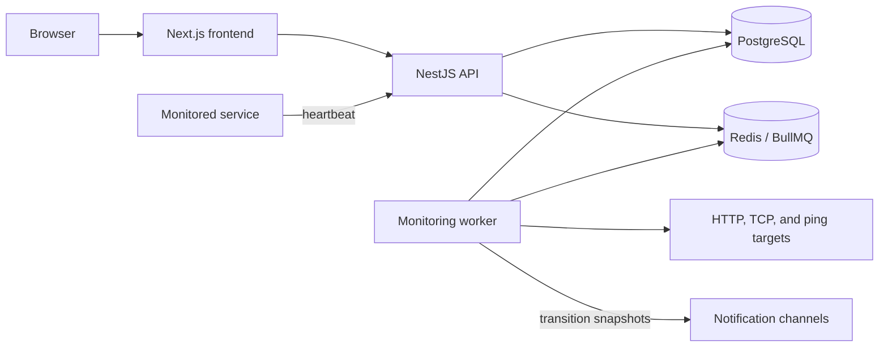

# SystemVitals architecture

SystemVitals monitors services with passive heartbeats and active probes. The repository is a Node.js 22 monorepo with independently deployable frontend, API, and worker applications.

## Components

- **Frontend**: Next.js application for the public site and authenticated monitoring interface.
- **API**: NestJS service that provides GraphQL management operations, REST authentication, heartbeat ingestion, health endpoints, and webhook handling.
- **Database**: Prisma schema package shared by the API and worker; PostgreSQL stores users, projects, checks, events, notification channels, and status pages.
- **Worker**: BullMQ consumers schedule active probes, detect missed heartbeats, and deliver transition notifications to each check's selected channels.
- **MCP integration**: an external API client for supported management tasks.

## Monitoring flow

1. A service sends a heartbeat, or the worker schedules an active probe.
2. The API or worker records a check event in PostgreSQL.
3. An actual transition to `DOWN`, or from `DOWN` to `UP`, atomically snapshots
   the check's effective channel IDs and queues a notification job in Redis.
4. The worker validates the snapshotted channels, delivers the transition
   notification, and records one delivery result per attempted channel.

Ordinary successful events do not produce recovery notifications, and changing
a channel selection while a check is already `DOWN` does not notify it
retroactively. Routing changes affect future transitions only.

## Per-check notification routing

The effective routing set is every globally enabled notification channel in
the check's project, minus rows in `CheckChannelExclusion`. Storing exclusions
instead of selections gives the system its default-all behavior:

- existing and new checks select every enabled project channel by default;
- a channel enabled later is selected unless that check explicitly excluded
  it;
- a check may exclude every channel, which the UI presents as
  `Notifications off`;
- moving a check to another project deletes its exclusions in the move
  transaction, so all enabled destination channels become selected.

GraphQL exposes the resulting IDs as
`CheckModel.notificationChannelIds`. The idempotent
`setCheckChannelEnabled(checkId, channelId, enabled)` mutation adds or removes
one exclusion after checking project ownership and the channel's global
enabled state. It does not create a check event or queue delivery work.

Recipient IDs are snapshotted inside the same locked database transaction that
commits a status transition. A worker treats a job's `channelIds` as
authoritative, including an empty array. Before delivery it still checks that
each channel exists, belongs to the check's current project, and remains
globally enabled; it does not reapply exclusions changed after the transition.
Only legacy jobs without `channelIds` resolve current exclusions at consumption
time, which keeps rolling deployments compatible with older producers.

## Historical Release 2 to Release 3 cleanup window

Release 2 retired the acknowledgement and delayed-escalation API, UI, worker
scheduling, and worker consumption paths. The legacy Prisma
`EscalationPolicy` and `Acknowledgement` models and tables remain dormant for
one rollback and observation window, as do the unused `QUEUE_ESCALATION`
configuration and Dokploy provisioning entry. No live product path reads or
writes those tables, and no worker produces or consumes that queue. Release 3
removes these compatibility artifacts after the observation window.

## Deployment boundaries

The API and worker share PostgreSQL and Redis but are deployed separately from the frontend. The API and worker Dockerfiles use the repository root as their build context because both consume the database package. The frontend Dockerfile uses `frontend/` as its build context. See [deployment](DEPLOYMENT.md) for the supported self-hosting and zero-downtime topologies.
