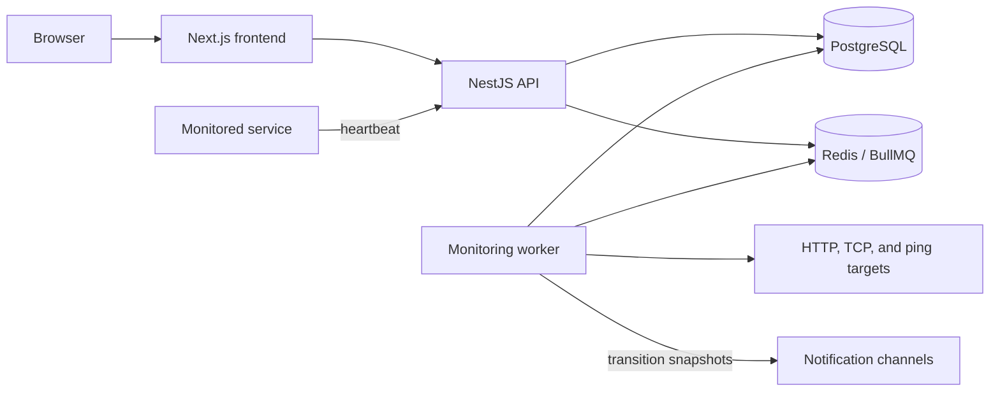

# SystemVitals architecture

SystemVitals monitors services with passive heartbeats and active probes. The repository is a Node.js 22 monorepo with independently deployable frontend, API, and worker applications.

## Components

- **Frontend**: Next.js application for the public site and authenticated monitoring interface.
- **API**: NestJS service that provides GraphQL management operations, REST authentication, heartbeat ingestion, health endpoints, and webhook handling.
- **Database**: Prisma schema package shared by the API and worker; PostgreSQL stores users, organizations, internal projects, checks, events, notification channels, and status pages.
- **Worker**: BullMQ consumers schedule active probes, detect missed heartbeats, and deliver transition notifications to each check's selected channels.
- **MCP integration**: an external API client for supported management tasks.

## Organization workspace facade

An organization is the only public workspace. Each organization owns exactly
one internal `Project` row so existing database relations, authorization
policy, worker jobs, and queued payloads can continue using their established
internal IDs. A unique `projects.organization_id` constraint enforces at most
one internal project, while organization and signup transactions create the
project atomically to enforce the complementary at-least-one rule.

Canonical workspace-scoped GraphQL and MCP operations accept
`organizationId`. The API verifies organization access and resolves that ID to
the internal project before calling existing services. Deprecated `projectId`
inputs, response fields, queries, tools, and legacy check routes remain
functional for this compatibility release only. Existing project-scoped API
tokens retain their stored internal scope and remain valid. Resource-addressed
operations continue to derive ownership from the check, channel, token, or
status-page ID rather than adding a redundant workspace selector.

Organization creation is the only way to create a workspace. The public
`createProject` operation is removed because a second project would violate the
invariant. The next cleanup release removes the deprecated public project
surface; deleting the internal `Project` table is a separate optional migration
that requires its own approved design.

## Monitoring flow

1. A service sends a heartbeat, or the worker schedules an active probe.
2. The API or worker records the check event and status in a locked PostgreSQL
   transaction.
3. If the event causes an actual transition to `DOWN`, or from `DOWN` to `UP`,
   the producer resolves the effective channel IDs while holding that
   transaction's lock. The status and event commit atomically; the returned
   channel IDs exist only in producer memory.
4. After that transaction commits, the producer queues a notification job in
   Redis carrying those IDs.
5. PostgreSQL and Redis are not coupled by a transactional outbox. An enqueue
   failure can therefore leave a committed transition without a notification
   job.
6. The worker validates the job's channels, delivers the transition
   notification, and records one delivery result per attempted channel.

Ordinary successful events do not produce recovery notifications, and changing
a channel selection while a check is already `DOWN` does not notify it
retroactively. Routing changes affect future transitions only.

## Per-check notification routing

The effective routing set is every globally enabled notification channel in
the check's organization workspace, minus rows in `CheckChannelExclusion`.
Internally, those resources remain related through the organization's sole
project. Storing exclusions instead of selections gives the system its
default-all behavior:

- existing and new checks select every enabled organization channel by default;
- a channel enabled later is selected unless that check explicitly excluded
  it;
- a check may exclude every channel, which the UI presents as
  `Notifications off`;
- moving a check to another organization deletes its exclusions in the move
  transaction, so all enabled destination channels become selected.

GraphQL exposes the resulting IDs as
`CheckModel.notificationChannelIds`. The idempotent
`setCheckChannelEnabled(checkId, channelId, enabled)` mutation adds or removes
one exclusion after checking organization ownership and the channel's global
enabled state. It does not create a check event or queue delivery work.

The producer resolves recipient IDs while it holds the same database lock used
for the transition, returns those IDs in process memory after the transaction
commits, and then puts them in the Redis job. A worker treats a present
`channelIds` field as authoritative, including an empty array. Before delivery
it still checks that each channel exists, belongs to the check's current
organization workspace, and remains globally enabled; it does not reapply
exclusions changed after the transition. Only legacy jobs without `channelIds`
resolve current exclusions at consumption time, which keeps rolling
deployments compatible with older producers.

## Release 3 cleanup

Release 3 cleanup is complete. Its operational gates passed, the retired
escalation queue was confirmed empty, and its remaining BullMQ metadata was
purged. The dormant legacy incident-state persistence, worker queue
configuration, environment example, and Dokploy provisioning entry have been
removed. Per-check notification routing through `CheckChannelExclusion`
remains the active model.

The current database is no longer compatible with application releases that
depend on those retired database tables. Recovering that data requires
restoring a pre-Release 3 database backup together with a matching application
release.

## Deployment boundaries

The API and worker share PostgreSQL and Redis but are deployed separately from the frontend. The API and worker Dockerfiles use the repository root as their build context because both consume the database package. The frontend Dockerfile uses `frontend/` as its build context. See [deployment](DEPLOYMENT.md) for the supported self-hosting and zero-downtime topologies.
