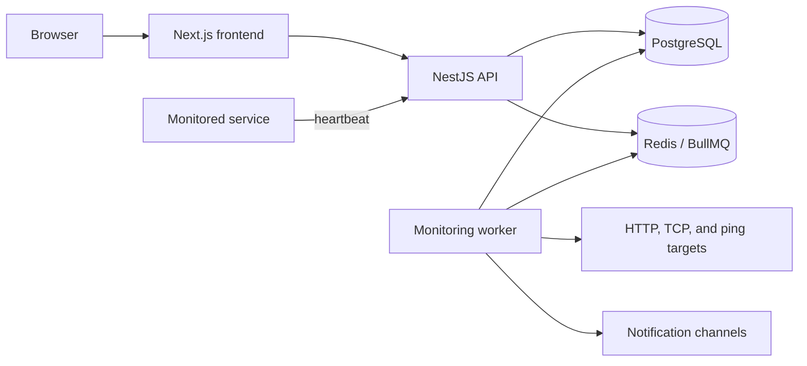

# SystemVitals architecture

SystemVitals monitors services with passive heartbeats and active probes. The repository is a Node.js 22 monorepo with independently deployable frontend, API, and worker applications.

## Components

- **Frontend**: Next.js application for the public site and authenticated monitoring interface.
- **API**: NestJS service that provides GraphQL management operations, REST authentication, heartbeat ingestion, health endpoints, and webhook handling.
- **Database**: Prisma schema package shared by the API and worker; PostgreSQL stores users, projects, checks, events, notification channels, and status pages.
- **Worker**: BullMQ consumers schedule active probes, detect missed heartbeats, and deliver notifications and escalation steps.
- **MCP integration**: an external API client for supported management tasks.

## Monitoring flow

1. A service sends a heartbeat, or the worker schedules an active probe.
2. The API or worker records a check event in PostgreSQL.
3. A state transition queues a notification job in Redis.
4. The worker delivers enabled notifications and records the delivery result.

## Deployment boundaries

The API and worker share PostgreSQL and Redis but are deployed separately from the frontend. The API and worker Dockerfiles use the repository root as their build context because both consume the database package. The frontend Dockerfile uses `frontend/` as its build context. See [deployment](DEPLOYMENT.md) for the supported self-hosting and zero-downtime topologies.
