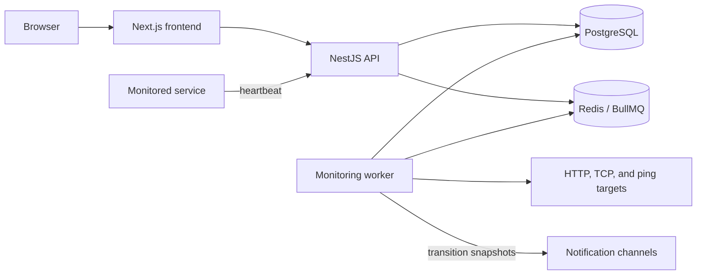

# SystemVitals architecture

SystemVitals monitors services with passive heartbeats and active probes. The repository is a Node.js 22 monorepo with independently deployable frontend, API, and worker applications.

## Components

- **Frontend**: Next.js application for the public site and authenticated monitoring interface.
- **API**: NestJS service that provides GraphQL management operations, REST authentication, heartbeat ingestion, health endpoints, and webhook handling.
- **Database**: Prisma schema package shared by the API and worker; PostgreSQL stores users, projects, checks, events, notification channels, and status pages.
- **Worker**: BullMQ consumers schedule active probes, detect missed heartbeats, and deliver transition notifications to each check's selected channels.
- **MCP integration**: an external API client for supported management tasks.

## Monitoring flow

1. A service sends a heartbeat, or the worker schedules an active probe.
2. The API or worker records the check event and status in a locked PostgreSQL
   transaction.
3. If the event causes an actual transition to `DOWN`, or from `DOWN` to `UP`,
   the producer resolves the effective channel IDs while holding that
   transaction's lock. The status and event commit atomically; the returned
   channel IDs exist only in producer memory.
4. After that transaction commits, the producer queues a notification job in
   Redis carrying those IDs.
5. PostgreSQL and Redis are not coupled by a transactional outbox. An enqueue
   failure can therefore leave a committed transition without a notification
   job.
6. The worker validates the job's channels, delivers the transition
   notification, and records one delivery result per attempted channel.

Ordinary successful events do not produce recovery notifications, and changing
a channel selection while a check is already `DOWN` does not notify it
retroactively. Routing changes affect future transitions only.

## Per-check notification routing

The effective routing set is every globally enabled notification channel in
the check's project, minus rows in `CheckChannelExclusion`. Storing exclusions
instead of selections gives the system its default-all behavior:

- existing and new checks select every enabled project channel by default;
- a channel enabled later is selected unless that check explicitly excluded
  it;
- a check may exclude every channel, which the UI presents as
  `Notifications off`;
- moving a check to another project deletes its exclusions in the move
  transaction, so all enabled destination channels become selected.

GraphQL exposes the resulting IDs as
`CheckModel.notificationChannelIds`. The idempotent
`setCheckChannelEnabled(checkId, channelId, enabled)` mutation adds or removes
one exclusion after checking project ownership and the channel's global
enabled state. It does not create a check event or queue delivery work.

The producer resolves recipient IDs while it holds the same database lock used
for the transition, returns those IDs in process memory after the transaction
commits, and then puts them in the Redis job. A worker treats a present
`channelIds` field as authoritative, including an empty array. Before delivery
it still checks that each channel exists, belongs to the check's current
project, and remains globally enabled; it does not reapply exclusions changed
after the transition. Only legacy jobs without `channelIds` resolve current
exclusions at consumption time, which keeps rolling deployments compatible
with older producers.

## Release 2 compatibility window and Release 3 exit criteria

Release 2 retired the acknowledgement and delayed-escalation API, UI, worker
scheduling, and worker consumption paths. The legacy Prisma
`EscalationPolicy` and `Acknowledgement` models and tables remain dormant for
one rollback and observation window, as do the unused `QUEUE_ESCALATION`
configuration and Dokploy provisioning entry. No live product path reads or
writes those tables, and no current worker produces or consumes that queue.
Release 2 remains an application-only rollout; it does not change or deploy
the infrastructure Compose project.

Do not begin the irreversible Release 3 cleanup until all of these conditions
are met:

- the Release 2 API, frontend, and worker are healthy and serving the intended
  current commit;
- no Release 1 application containers remain;
- the legacy queue has no active, delayed, or retry escalation jobs, or those
  jobs have been deliberately drained or purged;
- a verified `DOWN` followed by `DOWN` to `UP` recovery cycle creates no
  escalation work;
- a current database backup is verified restorable;
- the operator explicitly decides that rollback to Release 1 is no longer
  required.

After those gates pass, Release 3 can remove the dormant database models,
tables, queue configuration, and provisioning entry.

## Deployment boundaries

The API and worker share PostgreSQL and Redis but are deployed separately from the frontend. The API and worker Dockerfiles use the repository root as their build context because both consume the database package. The frontend Dockerfile uses `frontend/` as its build context. See [deployment](DEPLOYMENT.md) for the supported self-hosting and zero-downtime topologies.
